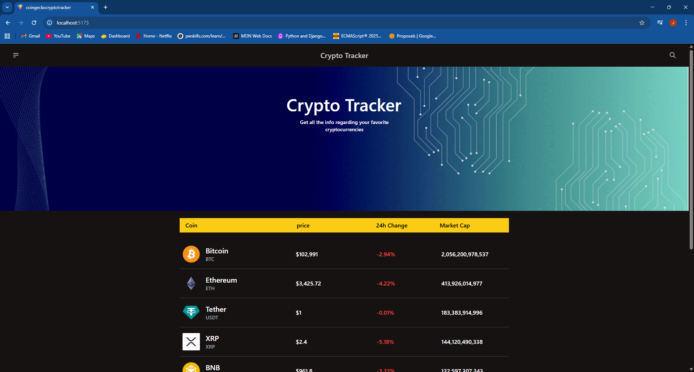
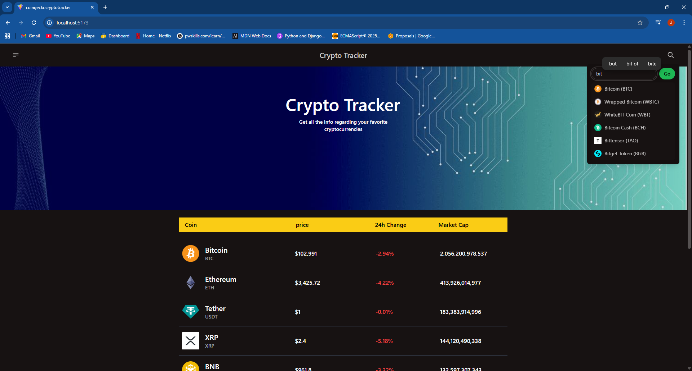
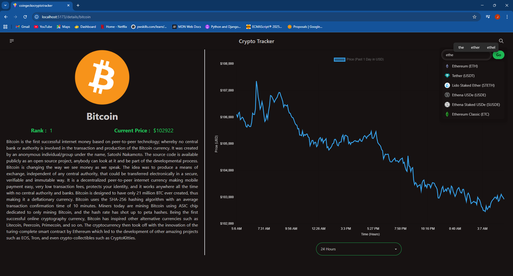
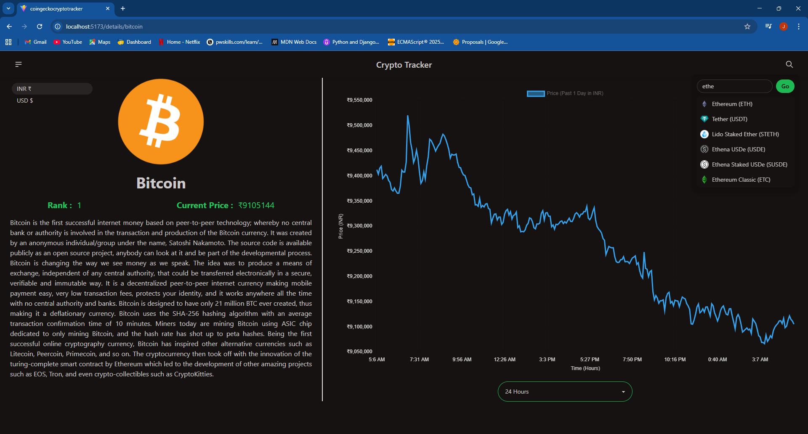

# 🚀 CoinGecko Crypto Tracker

A modern, responsive cryptocurrency tracking application built with React and Vite. Track real-time crypto prices, view historical data, and search for your favorite cryptocurrencies with ease.

## 📋 Table of Contents

- [Features](#features)
- [Technologies Used](#technologies-used)
- [Project Structure](#project-structure)
- [Installation](#installation)
- [Usage](#usage)
- [Project Overview](#project-overview)

## ✨ Features

- **Real-Time Crypto Data**: Display live cryptocurrency prices and market information
- **Advanced Search**: Search for cryptocurrencies with autocomplete suggestions
- **Currency Switching**: Toggle between USD ($) and INR (₹) currencies
- **Price Charts**: View historical price trends with interactive line charts
- **Detailed Coin Information**: Access comprehensive details about each cryptocurrency
- **Pagination**: Browse through multiple pages of cryptocurrency listings
- **Responsive Design**: Seamless experience across desktop, tablet, and mobile devices
- **Error Handling**: Robust error boundaries and user-friendly error messages
- **Loading States**: Content loaders for better UX during data fetching
- **Optimized Caching**: React Query integration for efficient data management

## 🛠️ Technologies Used

### Frontend Framework & Build Tools
- **[React](https://react.dev/)** (v19.2.0) - UI library for building interactive interfaces
- **[Vite](https://vitejs.dev/)** (v7.2.2) - Lightning-fast build tool and dev server
- **[@vitejs/plugin-react](https://github.com/vitejs/vite-plugin-react)** - React plugin for Vite

### Styling & UI Components
- **[Tailwind CSS](https://tailwindcss.com/)** (v3.4.18) - Utility-first CSS framework for rapid UI development
- **[DaisyUI](https://daisyui.com/)** (v4.12.24) - Component library built on Tailwind CSS
- **[PostCSS](https://postcss.org/)** (v8.5.6) - CSS transformation tool
- **[Autoprefixer](https://autoprefixer.github.io/)** (v10.4.21) - Vendor prefix automation

### Data Fetching & State Management
- **[@tanstack/react-query](https://tanstack.com/query/latest)** (v5.90.7) - Powerful async state management and server state synchronization
- **[Axios](https://axios-http.com/)** (v1.13.2) - Promise-based HTTP client for API requests
- **[Zustand](https://github.com/pmndrs/zustand)** (v5.0.8) - Lightweight state management library

### Routing & Navigation
- **[React Router DOM](https://reactrouter.com/)** (v7.9.5) - Client-side routing and navigation

### Data Visualization
- **[Chart.js](https://www.chartjs.org/)** (v4.5.1) - Flexible JavaScript charting library
- **[react-chartjs-2](https://react-chartjs-2.js.org/)** (v5.3.1) - React wrapper for Chart.js

### Additional Libraries
- **[html-react-parser](https://www.npmjs.com/package/html-react-parser)** (v5.2.8) - Parse HTML strings into React components
- **[react-content-loader](https://github.com/danilowoz/react-content-loader)** (v7.1.1) - SVG-based content loaders
- **[react-error-boundary](https://github.com/bvaughn/react-error-boundary)** (v6.0.0) - Error boundary wrapper for React

### Development Tools
- **[ESLint](https://eslint.org/)** (v9.39.1) - JavaScript linter for code quality
- **[@eslint/js](https://www.npmjs.com/package/@eslint/js)** - ESLint configuration
- **[eslint-plugin-react-hooks](https://www.npmjs.com/package/eslint-plugin-react-hooks)** - React hooks linting rules
- **[eslint-plugin-react-refresh](https://github.com/AlexxNB/eslint-plugin-react-refresh)** - React refresh plugin

### API
- **[CoinGecko API](https://www.coingecko.com/en/api)** - Free cryptocurrency data API (no authentication required)

## 📁 Project Structure

```
CoinGeckoCryptoTracker/
├── public/                          # Static assets
├── images/                          # Project images and screenshots
├── src/
│   ├── components/
│   │   ├── Alert/                  # Alert notification component
│   │   ├── Banner/                 # Hero banner component
│   │   ├── CoinInfo/              # Coin price chart components
│   │   │   ├── CoinInfo.jsx
│   │   │   └── CoinInfoContainer.jsx
│   │   ├── CoinTable/             # Cryptocurrency listing table
│   │   ├── CustomErrorBoundary/   # Error boundary wrapper
│   │   ├── NavBar/                # Navigation bar with search & currency toggle
│   │   ├── PageLoader/            # Content loader skeleton
│   │   └── Routing/               # Route configuration
│   ├── hooks/
│   │   ├── useFetchCoin.js        # Fetch single coin details
│   │   ├── useFetchCoinHistory.js # Fetch historical price data
│   │   ├── useFetchCoinSearch.js  # Search cryptocurrency suggestions
│   │   └── useFetchCoinTable.js   # Fetch coin market data table
│   ├── pages/
│   │   ├── Home.jsx               # Home page (banner + table)
│   │   ├── CoinDetailsPage.jsx    # Individual coin detail page
│   │   └── Layout.jsx             # Main layout wrapper
│   ├── Services/
│   │   ├── fetchCoinData.js       # API call for coin market data
│   │   ├── fetchCoinDetails.js    # API call for coin details
│   │   └── fetchCoinHistoricData.js # API call for historical data
│   ├── helpers/
│   │   ├── axiosInstance.js       # Configured axios instance
│   │   └── constants.js           # App constants (API URL, chart days)
│   ├── state/
│   │   └── store.js               # Zustand store for currency state
│   ├── assets/                    # Images and static files
│   ├── App.jsx                    # Root component
│   ├── main.jsx                   # React DOM entry point
│   ├── index.css                  # Global styles with Tailwind directives
│   └── App.css                    # App-specific styles
├── .gitignore
├── eslint.config.js               # ESLint configuration
├── postcss.config.js              # PostCSS configuration
├── tailwind.config.js             # Tailwind CSS configuration
├── vite.config.js                 # Vite configuration
├── index.html                     # HTML entry point
├── package.json                   # Project dependencies
└── README.md                      # Project documentation
```

## 🚀 Installation

1. **Clone the repository**
   ```bash
   git clone https://github.com/yourusername/CoinGeckoCryptoTracker.git
   cd CoinGeckoCryptoTracker
   ```

2. **Install dependencies**
   ```bash
   npm install
   ```

3. **Start the development server**
   ```bash
   npm run dev
   ```
   The application will be available at `http://localhost:5173`

4. **Build for production**
   ```bash
   npm run build
   ```

5. **Preview production build**
   ```bash
   npm run preview
   ```

6. **Run ESLint**
   ```bash
   npm run lint
   ```

## 📖 Usage

### Home Page
- View a paginated list of top cryptocurrencies by market cap
- See current prices, 24-hour changes, and market cap information
- Switch between USD and INR currencies

### Search & Navigation
- Use the search bar in the navbar to find specific cryptocurrencies
- Get real-time suggestions as you type
- Click on a coin to view detailed information

### Coin Details Page
- View comprehensive information about the selected cryptocurrency
- See the coin's rank, current price, and description
- Analyze historical price trends with interactive charts
- Select different time periods (24 hours to 365 days)

### Currency Toggle
- Switch between USD ($) and INR (₹) currencies
- All prices and data update instantly
- Currency preference is maintained in the app state

## 🎨 Key Features Explained

### Real-Time Data Fetching
The app uses **React Query** for efficient data management with automatic caching and refetching:
- Market data is cached for 2 minutes
- Historical data is optimized with interval parameters
- Error retry logic with exponential backoff

### State Management
**Zustand** store manages the global currency state:
```javascript
const store = create((set) => ({
    currency: 'usd',
    setCurrency: (newCurrency) => set({ currency: newCurrency }),
}));
```

### Search with Debouncing
The search component implements debouncing to reduce API calls:
- Waits 500ms after user stops typing
- Minimum 3 characters required for search
- Displays up to 6 suggestions

### Error Handling
**React Error Boundary** catches and displays errors gracefully with:
- Custom error UI
- Retry functionality
- Fallback component rendering

### Responsive Design
Built with **Tailwind CSS** breakpoints for mobile-first approach:
- Mobile: Single column layouts
- Tablet: Medium breakpoints
- Desktop: Full multi-column layouts

### Interactive Charts
**Chart.js** with React wrapper displays:
- Line charts for price trends
- Dynamic labels based on selected time period
- Responsive sizing
- Currency-aware formatting

## 🌐 API Integration

The app uses the **CoinGecko API** (free tier, no authentication required):

### Endpoints Used
- `/coins/markets` - Market data for multiple coins
- `/coins/{id}` - Detailed information for a specific coin
- `/coins/{id}/market_chart` - Historical price data
- `/search` - Search suggestions

### Example API Calls
```javascript
// Fetch market data
GET https://api.coingecko.com/api/v3/coins/markets?vs_currency=usd&order=market_cap_desc&per_page=10&page=1

// Fetch coin details
GET https://api.coingecko.com/api/v3/coins/bitcoin

// Fetch historical data
GET https://api.coingecko.com/api/v3/coins/bitcoin/market_chart?days=7&vs_currency=usd&interval=daily

// Search coins
GET https://api.coingecko.com/api/v3/search?query=bitcoin
```

## 📱 Screenshots

### Home Page - Coin Listing

*Browse the top cryptocurrencies with real-time prices and 24-hour changes*

### Coin Details Page

*View detailed information with interactive price charts and historical data*

### Search Functionality

*Autocomplete search with real-time suggestions for quick coin discovery*

### Mobile Responsive View

*Seamless experience on mobile devices with optimized layouts*

### Currency Toggle

*Switch between USD and INR currencies with instant updates*

Add project screenshots here:
```
- Home page with coin table
- Coin details page with chart
- Search functionality
- Mobile responsive view
- Currency toggle feature
```

## 🔧 Performance Optimizations

- **Code Splitting**: Lazy loading of pages using React.lazy()
- **Suspense Boundaries**: Loading fallbacks during component loading
- **Query Caching**: React Query caches reduce redundant API calls
- **Debounced Search**: Reduces API requests during typing
- **Image Lazy Loading**: Images load only when needed

## 🐛 Error Handling

- **Error Boundaries**: Catches React component errors
- **API Error Handling**: Try-catch blocks with user-friendly messages
- **Retry Logic**: Automatic retry with configurable delays
- **Loading States**: Clear feedback during data fetching

## 📝 Future Enhancements

- Add user authentication and watchlist functionality
- Implement price alerts and notifications
- Add more chart types and technical indicators
- Portfolio tracking with investment analysis
- Dark/Light theme toggle
- PWA support for offline usage
- Advanced filters and sorting options
- Export data to CSV/PDF

## 📄 License

This project is open source and available under the MIT License.

## 👨‍💻 Contributing

Contributions are welcome! Please feel free to submit a Pull Request.

## 📧 Contact

For questions or feedback, please reach out through GitHub issues.

---

**Happy Crypto Tracking! 🎉**